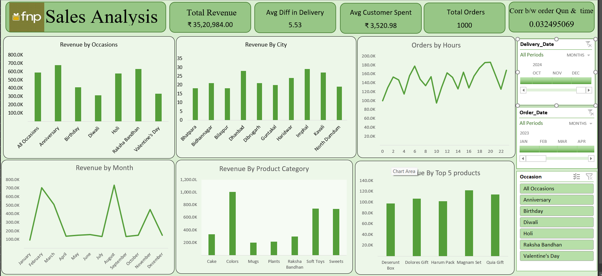

# fnp_sales_analysis

This dashboard provides a comprehensive analysis of sales data for a company, focusing on various metrics and dimensions. The key insights from the dashboard are as follows:

1.Total Revenue: The company has generated a total revenue of ₹35,20,984.00.

2. Average Difference in Delivery: The average difference in delivery time is 5.53 days.

3. Average Customer Spent: On average, each customer has spent ₹3,520.98.

4. Total Orders: The total number of orders placed is 1,000.

5. Correlation Between Order Quantity and Time: The correlation coefficient between order quantity and time is 0.032495069, indicating a very weak positive correlation.

# Revenue Analysis
By Occasions: The highest revenue is generated during Birthdays and Anniversaries, followed by Raksha Bandhan and Valentine's Day. Diwali and Holi also contribute significantly but less compared to the aforementioned occasions.

1. By City: The cities of Dhanbad, Haridwar, and Imphal show the highest revenue generation. Other notable cities include Bhavnagar, Bilaspur, Dibrugarh, Guntakal, and Kavali.

2. By Month: August and February are the peak months for revenue, with significant dips in the middle of the year (May and June).

3. By Product Category: The highest revenue is generated from the sale of Cakes, followed by Soft Toys and Sweets. Mugs, Plants, and Raksha Bandhan products also contribute but to a lesser extent.

4. Top 5 Products: The top five products in terms of revenue are Deserunt Box, Dolores Gift, Harum Pack, Magnam Set, and Quia Gift.

Orders Analysis
By Hours: The number of orders fluctuates throughout the day, with noticeable peaks around 10 AM and 8 PM.

# Insights
1. Peak Revenue Periods: The dashboard reveals that August and February are the peak months for revenue generation. This might indicate seasonal trends or special events that significantly boost sales during these periods.

2. High-Performing Occasions: Birthdays and Anniversaries contribute the highest revenue among all occasions. This insight suggests that marketing efforts and product offerings tailored to these occasions are highly effective.

3. Top Revenue-Generating Cities: Cities like Dhanbad, Haridwar, and Imphal are top performers in terms of revenue. This information can guide targeted marketing campaigns and inventory management in these areas to further capitalize on their potential.

4. Popular Product Categories: Cakes are the leading product category in revenue generation, followed by Soft Toys and Sweets. This indicates a strong preference for these items, which can inform product development and promotional strategies.

5. Customer Spending Patterns: On average, customers spend ₹3,520.98. Understanding this average spend can help in designing pricing strategies and bundling offers that match customers' spending behavior.

6. Performance Metrics: The average difference in delivery time is 5.53 days, highlighting an area for potential improvement in logistics and customer satisfaction.

7. Order Timing: The number of orders peaks around 10 AM and 8 PM, suggesting that these are prime times when customers are most active. This insight can be used to optimize marketing efforts and customer engagement during these hours.

# Concluding Statement
This sales analysis dashboard provides a comprehensive and insightful view of the company's performance across various dimensions, including revenue, customer behavior, and product categories. The detailed breakdown by occasions, cities, months, and top products highlights key areas of success and opportunities for improvement. By leveraging these insights, the company can strategically focus its efforts to enhance customer satisfaction and drive further growth. The inclusion of interactive filters enhances the usability of the dashboard, allowing for a more tailored and in-depth analysis. Overall, this dashboard is an invaluable tool for informed decision-making and strategic planning.

